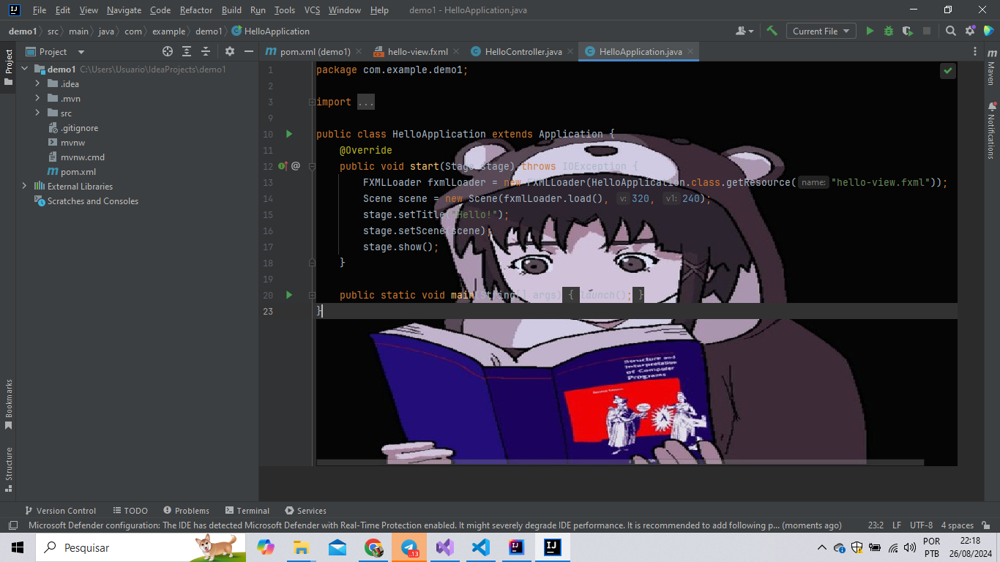
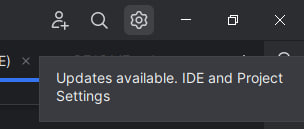
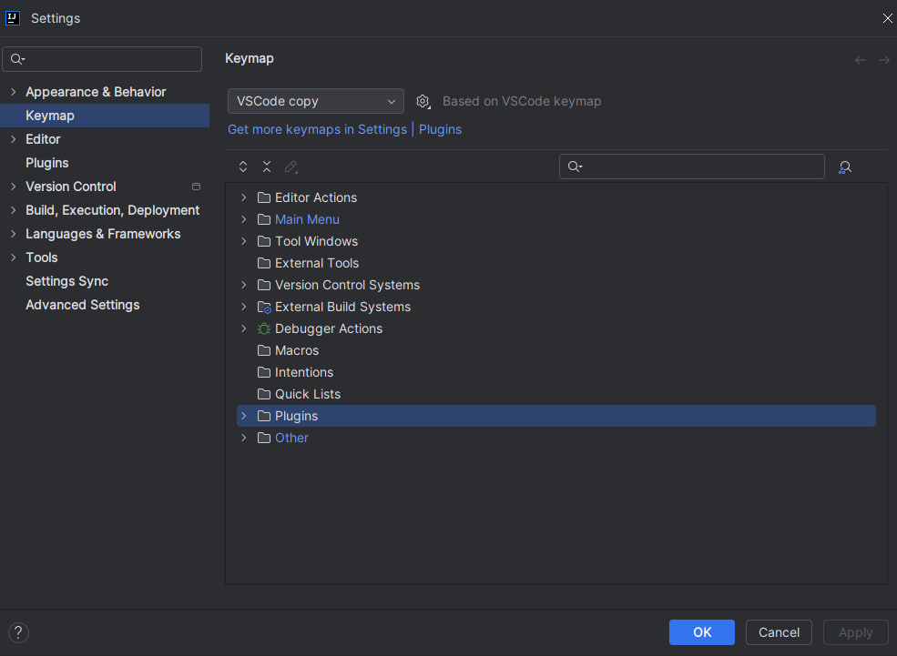
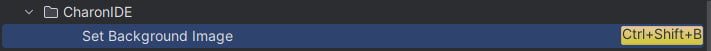
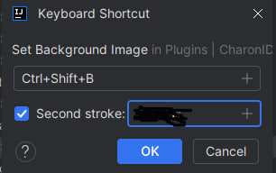

## CharonIDE

CharonIDE is a plugin for the JetBrains IDEs made based on the vstudio plugin <a href="https://github.com/buchizo/ClaudiaIDE">ClaudiaIDE</a> that allows users to customize the appearance of the editor by setting a custom background image. With CharonIDE, you can select any image on your system to use as a background in the editor, providing a more personalized and enjoyable development experience.

Features
* Choosing Background Image: 

Use the keyboard shortcut Ctrl + Shift + B to open the file manager and select the image you want to set as the editor's background.

* IDE integration: 

The plugin is perfectly integrated with JetBrains IDEs, making customization of the development environment simple and intuitive.

## How to use

* click the gear button in the top right corner

* Right after clicking the gear button, click on the field written settings.

* In settings, click on keymap and then in plugins.

* Then click on CharonIDE and set background image

* Afterwards, a confirmation screen will appear, click ok.

and then just press the keyboard shortcut ctrl + shift + B which will open a screen where you can select a background image for your ide.

## Contributing

That said, there's a bunch of ways you can contribute to this project, like by:

* ⭐ Giving a star on this repository (this is very important and costs nothing)
* 🪲 Reporting a bug
* 📄 Improving this documentation
* 🚨 Sharing this project and recommending it to your friends
* ✏️ Or you can contribute code by following this <a href="./docs/CONTRIBUTING.md">guide.</a>

## Contributors

This project exists thanks to all the people who contribute.

